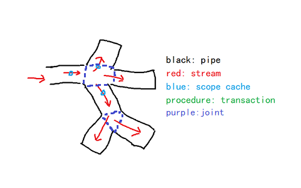

# Abstract
* a mini framework for quickly building or assembling your application  

# Solution
* solve the complex dependency relationship among codes in the complex application  
* eliminate the details of the threads, asynchronous, eventloop, communication method, and other complex mechanism in the codes and make the codes more elegent by a graph or a stream. help the developers to only pay attentions on the business logic  
* provide a uniform grammer and strategy for the application layer of the software in order to help application developers to get rid of the properties of program language. Developers can easily use any language to realize the functions which this language does not provide. support multiple languages in the application naturally  
* support aop program naturally  
* support the modularization and distribution for the application with complex structure  

# Rreference
* *stream program*  
* *reactive program*  
* *aspect oriented program*  
* *eventloop*  

# Concept  
* pipe: a function wrapper which does something with some special logic  
* stream: a data wrapper which is transported in the pipes  
* scope cache: a cache data which based on some streams or all the streams  
* joint: the aspects could be injected between two pipes  

 

# Language
* *c++*  
* *qml*  
* *js*  
* *python* (develop in the future)
* *java* (develop in the future)
* *delphi* (develop in the future)

# Repositories
[get demo code](https://www.robbeykaaso.work:3000/test/download/rea-develop.zip)  
[get demo binary](https://www.robbeykaaso.work:3000/test/download/rea-demo.zip)