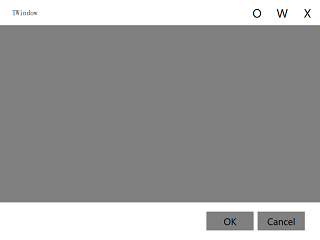

# Abstract
* the uniform window component for qml  

# Attribute
* caption: the title of the window  
* content: the content of the window
* titlebuttons: the head buttons on the title bar
* footbuttons: the foot buttons on the window foot  
_sample_:
```
    TWindow{
        id: twin
        caption: qsTr("TWindow")
        content: Column{
            anchors.fill: parent
            Rectangle{
                width: parent.width
                height: parent.height
                color: "gray"
            }
        }
        titlebuttons: [{cap: "O", func: function(){console.log("hello")}},  //cap is the text, func is the callback
                        {cap: "W", func: function(){console.log("world")}}]
        footbuttons: [{cap: "OK", func: function(){close()}},
                        {cap: "Cancel", func: function(){close()}}]
    }
```  
<center><p></p></center>  
</br>
